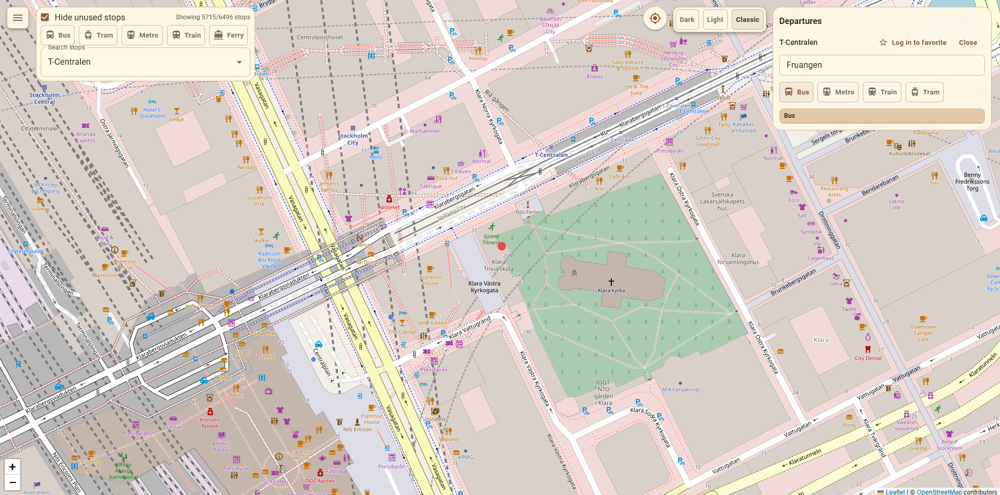
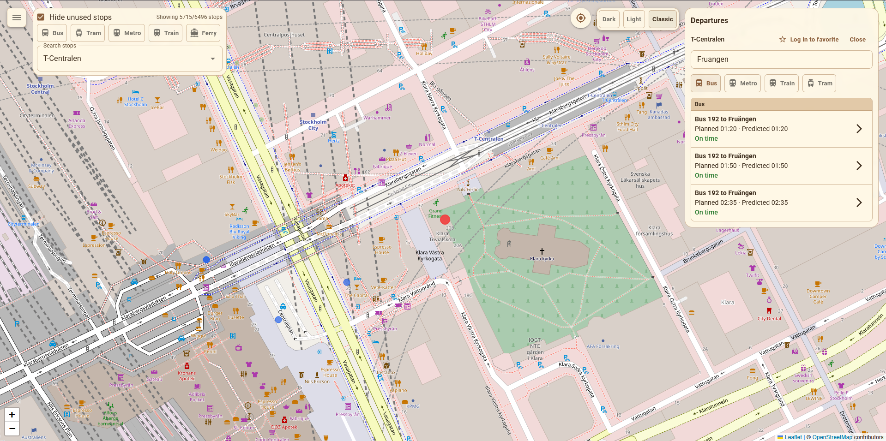
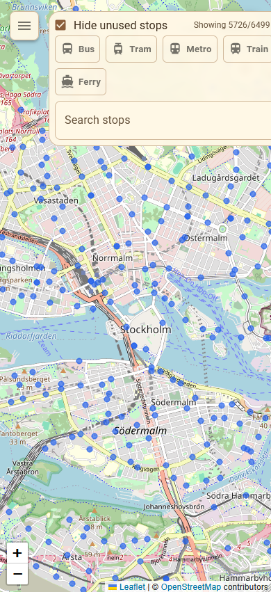
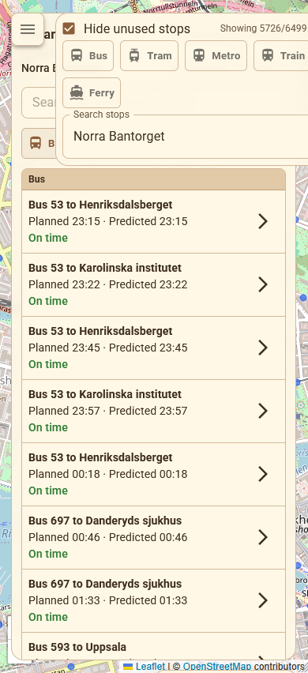
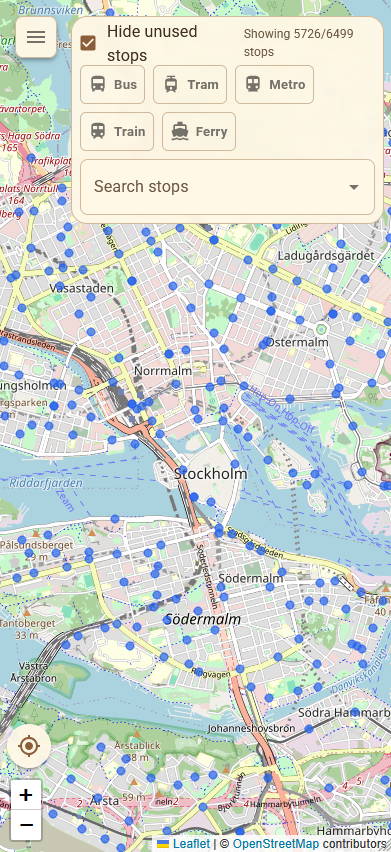
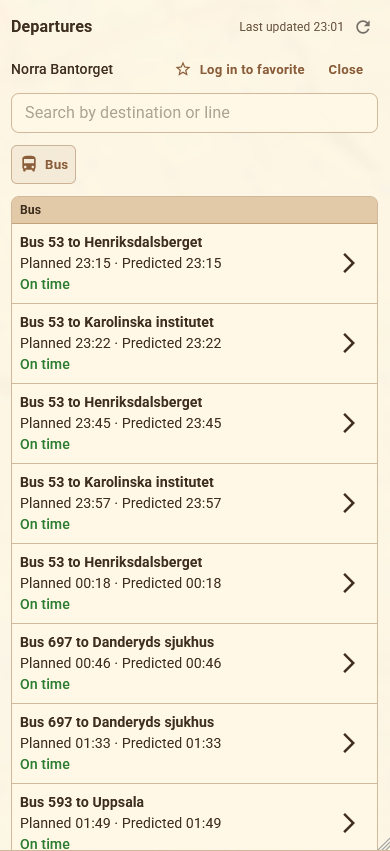
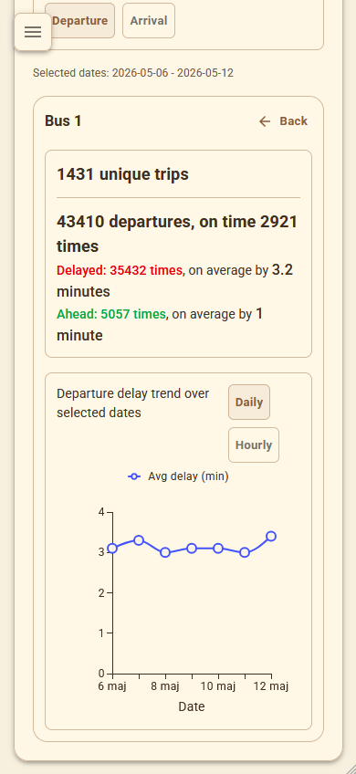
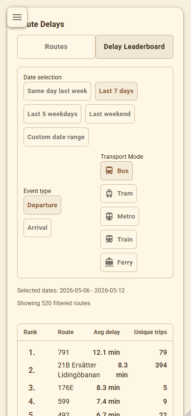
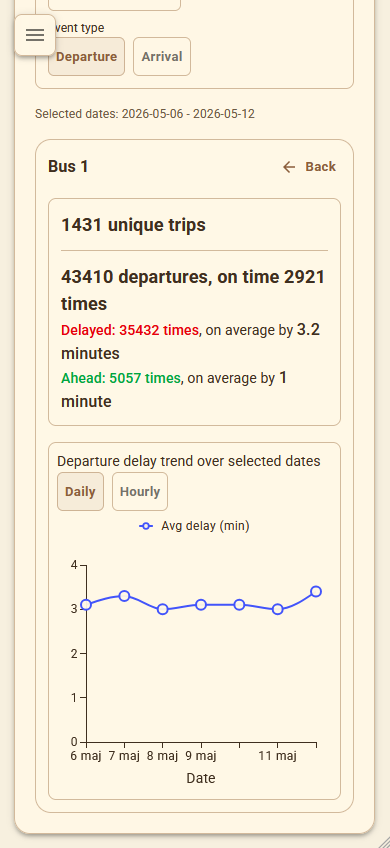
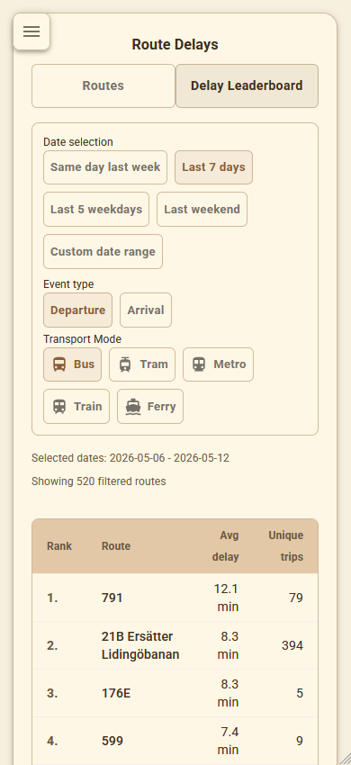

## Prototyping Stage User Consultation (2026-03-21)

To satisfy the prototyping-stage user consultation requirement, a documented user consultation was carried out and recorded in [Issue #30](https://github.com/mattiaskvist/forseningskartan/issues/30).

### Feedback received

The consultation produced the following suggestions:

1. Show where delays happen on the map, for example with lines drawn on specific streets where delays happen due to traffic etc.
2. Unclear that departures in departure list can be selected, add an arrow to show that.
3. Would be good to see the route of the bus/train/metro when a departure is selected, see where it goes and to what stops on the map.
4. The departure list can be long, group departures by mode of transport in departure list and allow filtering.

### Addressing feedback

1. Quite difficult to implement, added as a stretch goal [Issue #44: Show where delays happen on the map](https://github.com/mattiaskvist/forseningskartan/issues/44).
2. Addressed in [Issue #43: Addressing feedback from prototyping stage user consultation](https://github.com/mattiaskvist/forseningskartan/issues/43).
3. Was already an idea to implement in [Issue #12: Get live vehicle position and draw route on map](https://github.com/mattiaskvist/forseningskartan/issues/12).
4. Addressed in [Issue #43: Addressing feedback from prototyping stage user consultation](https://github.com/mattiaskvist/forseningskartan/issues/43).

\newpage
## Evaluation stage user consultation (2026-05-11)

To satisfy the evaluation-stage user consultation requirement, a user consultation was carried out and recorded in [Issue #31](https://github.com/mattiaskvist/forseningskartan/issues/31).

### Feedback received

The consultation produced the following suggestions:

1. When you search for a destination like Fruängen, if the user omits the accent (Fruangen), you should still display Fruängen for user convenience probably. This person used a US keyboard.
2. Sign in with email box should also have dark mode to match the rest of the app in dark mode. Since the Mui around is dark mode, but the firebase ui remains light mode still.
3. I think after some zooming in on map, the circles should stop getting smaller (like beyond the third to last zoom, they should remain same size as third to last zoom probably).
4. Add some top padding/margin to the search stops searchbar, since when you select a stop it overlaps the ferry somewhat.
5. If possible, it would be very nice to see the whole route on the map when you click on a route.
6. Mobile is pretty much unusable.

### Addressing feedback

1. Addressed in [Issue #153: Addressing feedback from evaluation stage user consultation](https://github.com/mattiaskvist/forseningskartan/issues/153).
2. Does not seem possible to customize the Google sign-in popup.
3. Addressed in [Issue #153: Addressing feedback from evaluation stage user consultation](https://github.com/mattiaskvist/forseningskartan/issues/153).
4. Addressed in [Issue #153: Addressing feedback from evaluation stage user consultation](https://github.com/mattiaskvist/forseningskartan/issues/153).
5. Was already an idea to implement in [Issue #12: Get live vehicle position and draw route on map](https://github.com/mattiaskvist/forseningskartan/issues/12).
6. Addressed in [Issue #154: Adapt frontend to mobile](https://github.com/mattiaskvist/forseningskartan/issues/154)

Images showing before and after addressing feedback points 1, 3, and 4, and before and after adapting to mobile are shown below.

\newpage
Before addressing 1, 3, and 4:

After addressing 1, 3, and 4 (Searching for "Fruangen" now correctly shows "Fruängen", circles on map stop getting smaller after a certain zoom level, and search bar has more top padding):

\newpage
Before adapting to mobile (map view):

{ width=50% }
{ width=50% }

\newpage
After adapting to mobile (map view) (no overlapping elements, departure list in full screen):

{ width=50% }
{ width=50% }

\newpage
Before adapting to mobile (route delay view):

{ width=50% }
{ width=50% }

\newpage
After adapting to mobile (route delay view) (filter options aligned better, wider trend chart, columns in leaderboard view aligned):

{ width=50% }
{ width=50% }